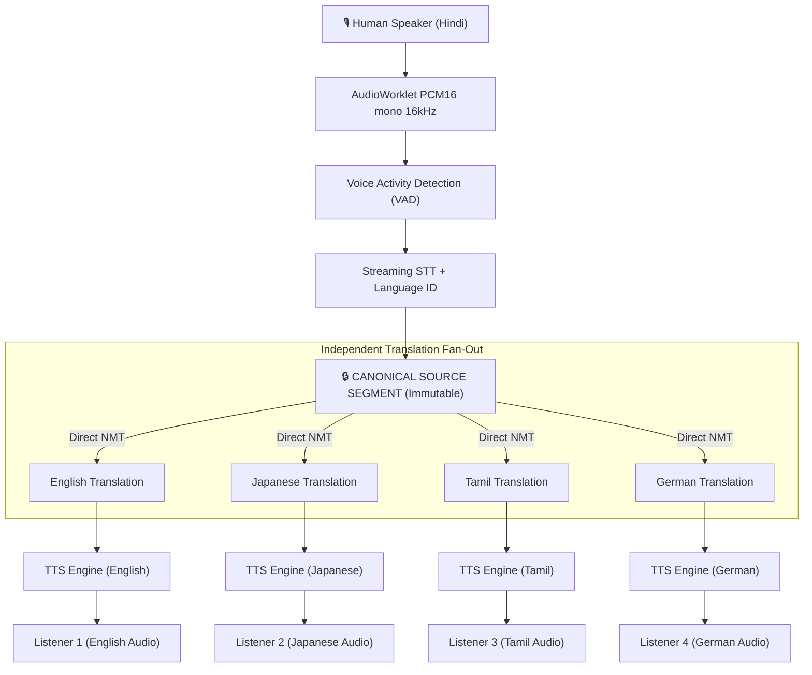

# The Canonical Source Invariant

At the core of GlobalTalk AI’s architecture is a fundamental design invariant:

> **The human voice or human text is the ONLY semantic source of truth.**
> Everything else—transcripts, translations, TTS audio streams, agent summaries—is a derivative artifact carrying an immutable reference to `source_segment_id`.

---

## 🚫 The Flaw of Translation Cascades (Chaining)

Many traditional translation systems chain intermediate languages when translating between low-resource or distant language pairs:

### The Degradation Problem
1. **Semantic Drift**: Nuances lost in step 1 are permanently distorted in step 2. Cultural honorifics in Hindi (*Aap*) translated to ambiguous English (*you*) lose their respectful connotation when translated into Japanese (*anata* instead of honorific *keigo*).
2. **Hallucination Cascades**: A minor ASR error or translation hallucination in the pivot language compounds exponentially down the chain.
3. **Latency Accumulation**: Chained inference serializes network round-trips and transformer forward passes, destroying real-time conversation flow ($>2.5\text{s}$ latency).

---

## ✅ GlobalTalk AI Direct Fan-Out Architecture

GlobalTalk AI strictly forbids translation chaining. In any multi-lingual room (e.g. 10 participants speaking 6 languages), every listener receives a translation generated **directly and independently** from the human speaker’s canonical segment:

---

## 🔒 Immutability Guarantees

In the GlobalTalk AI database schema and in-memory message bus:

1. **`TranscriptSegment` is immutable once finalized**:
   - Once `is_final == true`, no SQL `UPDATE` path exists for `canonical_text` or `source_language`.
2. **Derivative Artifact Tracking**:
   - `TranslationSegment.source_segment_id` must match a valid, existing `TranscriptSegment.id`.
   - `TranslationSegment.source_kind` explicitly records `{transcript, chat, document}`.
3. **No Feedback Loops**:
   - Synthesized TTS audio is never routed back into STT models as a new human turn.
   - LLM-generated summaries or agent responses are explicitly marked `is_agent = true` and never serve as human ground truth.
