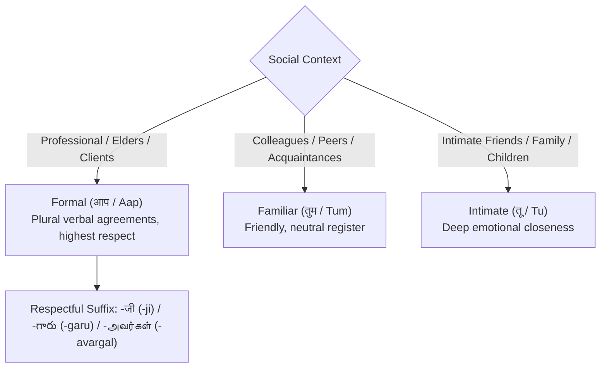

# Desi Indic Linguistic AI

South Asian languages possess distinct sociolinguistic structures, hierarchical honorific systems, and script nuances that generic translation engines fail to capture. The **Desi Indic AI Engine** is purpose-built to address these challenges with native precision.

---

## 1. 3-Tier Cultural Honorifics

In Hindi and other Indic languages, addressing another person requires selecting between distinct pronoun and verbal inflection tiers based on social context, age, hierarchy, and intimacy:



### Honorific Parameters in API
When calling `/v2/desi/translate`, pass `honorific` and optionally `respectful_suffix`:

```json
{
  "text": "What do you think about this proposal?",
  "target_lang": "hi",
  "honorific": "formal",
  "respectful_suffix": true
}
```

| Honorific Tier | Pronoun | Hindi Output Example |
|---|---|---|
| `formal` | आप (*Aap*) | आपका इस प्रस्ताव के बारे में क्या विचार है जी? |
| `familiar` | तुम (*Tum*) | तुम्हारा इस प्रस्ताव के बारे में क्या विचार है? |
| `intimate` | तू (*Tu*) | तेरा इस प्रस्ताव के बारे में क्या विचार है? |

---

## 2. Phonetic Script Transliteration

Hundreds of millions of internet users across India communicate daily using Latin/Roman alphabet transliterations (commonly known as *Hinglish*, *Tanglish*, *Benglish*, etc.). 

The `/v2/desi/transliterate` endpoint provides bidirectional phonetic mapping between Romanized text and native Brahmic scripts:

```bash
curl -X POST "https://api.globaltalk.ai/v2/desi/transliterate" \
  -H "X-API-Key: $GTK_API_KEY" \
  -H "Content-Type: application/json" \
  -d '{
    "text": "Namaste dosto, kya haal chaal hai",
    "source_script": "latin",
    "target_script": "devanagari"
  }'
```

### Transliteration Output
```json
{
  "results": [
    {
      "source_text": "Namaste dosto, kya haal chaal hai",
      "transliterated_text": "नमस्ते दोस्तो, क्या हाल चाल है",
      "source_script": "latin",
      "target_script": "devanagari",
      "characters": 33
    }
  ]
}
```

### Supported Scripts
- `devanagari` (Hindi, Marathi, Sanskrit, Nepali, Maithili, Konkani, Bodo, Dogri)
- `bengali` (Bengali, Assamese)
- `gurmukhi` (Punjabi)
- `gujarati` (Gujarati)
- `odia` (Odia)
- `tamil` (Tamil)
- `telugu` (Telugu)
- `kannada` (Kannada)
- `malayalam` (Malayalam)

---

## 3. Indic Unicode Normalization & Nukta Resolution

Indic digital text often contains typographic inconsistencies due to disparate virtual keyboards, legacy fonts, and improper Unicode codepoint sequences. Common defects include:

1. **Zero-Width Joiner (ZWJ `U+200D`) and Non-Joiner (ZWNJ `U+200C`) Anomalies**: Redundant joiners disrupt text rendering, search indexing, and NLP embeddings.
2. **Nukta Decomposition**: Characters like `क़` can be represented either as a single precomposed codepoint (`U+0958`) or as a base consonant `क` (`U+0915`) followed by the combining nukta mark `़` (`U+093C`).

The `/v2/desi/normalize` endpoint standardizes texts into canonical NFC composed forms and purges orphan joiners:

```bash
curl -X POST "https://api.globaltalk.ai/v2/desi/normalize" \
  -H "X-API-Key: $GTK_API_KEY" \
  -H "Content-Type: application/json" \
  -d '{
    "text": "क़िताब में सही वर्ण विन्यास",
    "clean_zwnj": true,
    "fix_nuktas": true
  }'
```

### Normalized Output
```json
{
  "original_text": "क़िताब में सही वर्ण विन्यास",
  "normalized_text": "क़िताब में सही वर्ण विन्यास",
  "corrections_count": 1,
  "script": "Devanagari"
}
```
