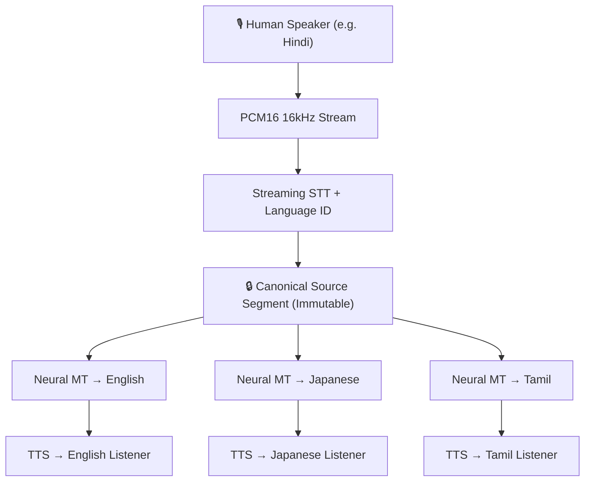

# GlobalTalk AI & Desi Language AI

**GlobalTalk AI** is an open-source, production-ready neural language intelligence platform designed to eliminate linguistic barriers in real time. It enables conversations where every participant speaks, listens, reads, and writes in their native language—with ultra-low latency, layout-preserving document translation, and deep cultural nuance.

Underpinning the platform is **Desi Language AI**, a specialized engine engineered specifically for the linguistic and cultural complexities of South Asian languages, featuring native honorific controls (*Aap / Tum / Tu*), phonetic transliteration, and Unicode sanitization.

---

## 🌟 Key Capabilities

| Capability | Description |
|---|---|
| 🎙️ **Real-Time Voice Translation** | Full-duplex speech-to-speech translation over WebRTC/WebSocket with `<800ms` end-to-end latency. |
| 🇮🇳 **Desi Indic AI Engine** | Deep cultural support for all **22 official Eighth Schedule Indian languages**, featuring 3-tier formality, respectful suffixes, and transliteration. |
| 🌍 **100+ World Languages** | Broad coverage across European, Asian, African, and Middle Eastern languages with automated language identification. |
| 📄 **Document Translation** | Asynchronous, layout-preserving document translation for PDF, DOCX, PPTX, XLSX, HTML, and plain text. |
| ✍️ **Desi Write (AI Writing Assistant)** | Rephrasing, tone adjustment (Academic, Business, Casual, Simple), and grammar/spelling correction. |
| 📚 **Glossaries & Translation Memory** | Deterministic term enforcement and fuzzy translation memory (TM) matching. |
| 🤖 **Model Context Protocol (MCP)** | Stdio MCP servers for seamless integration with AI developer tools like Claude Code, Cursor, and VS Code. |
| ⚖️ **100% Pure MIT Clean-Room** | Zero proprietary trademark liabilities or closed third-party dependencies. Free, open, and enterprise-ready. |

---

## 🏛️ The Core Rule: Canonical Source Invariant

Every real-time voice conversation and document translation in GlobalTalk AI adheres to a strict architectural rule:

> **The human speaker or writer is the sole semantic source of truth.**

### Why This Matters

Traditional translation cascades often chain languages:
$$\text{Hindi} \longrightarrow \text{English} \longrightarrow \text{Japanese}$$

This chaining compounds translation errors and hallucinatory drift at every step. GlobalTalk AI strictly enforces **direct fan-out**: every target translation derives independently from the single, immutable **Canonical Source Segment**.

---

## 🛠️ Developer Ecosystem

- **REST API (v2 / v3)**: Fully conformant HTTP APIs with rate limiting, metering, and OpenAPI 3.1.0 specifications.
- **Client SDKs**:
  - [Java SDK (`com.desi.api:desi-java`)](/documentation/sdks-and-tools#java-sdk) (Java 11+, zero runtime dependencies)
  - [.NET SDK (`GlobalTalk.Desi`)](/documentation/sdks-and-tools#net-sdk) (C#, .NET Standard 2.0, .NET 6/8)
  - [Python SDK (`desi-python`)](/documentation/sdks-and-tools#python-sdk) (Python 3.9+)
  - [Node.js SDK (`@globaltalk/sdk`)](/documentation/sdks-and-tools#nodejs-sdk) (Node 18+)
- **AI Tooling**:
  - [Stdio MCP Servers](/documentation/mcp-server) for Claude Code, Cursor, and VS Code.
