# Database

PostgreSQL in production (pgvector enabled), SQLite in dev — identical SQLAlchemy models,
Alembic migration `d6049c5192e5_initial_schema` (39 tables) is the schema source of truth.
UUID (CHAR(36)) primary keys, `created_at/updated_at` everywhere, FK cascades, deliberate
indexes (tenant+time, meeting+sequence, lookup hashes).

## ER overview (mermaid)

```mermaid
erDiagram
  users ||--o{ organization_members : ""
  organizations ||--o{ organization_members : ""
  organizations ||--o{ projects : ""
  users ||--o{ sessions : ""
  users ||--o{ refresh_tokens : ""
  sessions ||--o{ refresh_tokens : ""
  organizations ||--o{ api_keys : ""
  organizations ||--o{ meetings : ""
  organizations ||--o{ subscriptions : ""
  organizations ||--o{ billing_events : ""
  organizations ||--o{ usage_records : ""
  organizations ||--o{ glossaries : ""
  glossaries ||--o{ glossary_terms : ""
  organizations ||--o{ translation_memories : ""
  organizations ||--o{ style_profiles : ""
  organizations ||--o{ documents : ""
  documents ||--o{ document_jobs : ""
  documents ||--o{ document_segments : ""
  meetings ||--o{ participants : ""
  participants ||--|| participant_preferences : ""
  meetings ||--o{ audio_sessions : ""
  meetings ||--o{ transcript_segments : ""
  meetings ||--o{ chat_messages : ""
  transcript_segments ||--o{ translation_segments : "source_segment_id"
  chat_messages ||--o{ translation_segments : "source_segment_id"
  organizations ||--o{ webhooks : ""
  webhooks ||--o{ webhook_deliveries : ""
  organizations ||--o{ memory_items : ""
  organizations ||--o{ agent_sessions : ""
  organizations ||--o{ audit_logs : ""
  users ||--o{ voice_consents : ""
```



## Table groups

**Identity & tenancy** — users, organizations, organization_members, projects, sessions,
refresh_tokens, api_keys. Passwords bcrypt(12); refresh tokens and API keys stored as
SHA-256 hashes only.

**Language & model truth** — language_capabilities (per-language, per-modality, validated
statuses EXPERIMENTAL/BETA/SUPPORTED/PRODUCTION + provider bindings),
language_pair_validations (each pair direction/task independently evaluated),
model_registry (task, provider, model_id, pinned revision, license + review status,
production_status, hardware, latency/quality).

**Meetings & realtime** — meetings (room_name + join_token), participants,
participant_preferences ("I speak / I hear / audio_mode / caption_mode / latency_mode" —
the routing truth), audio_sessions (transport, dropouts, reconnects), transcript_segments
(**canonical source**; immutable finals; sequence per meeting; audio_key under retention),
translation_segments (**derivatives**; UNIQUE(source_segment_id, target_language) —
the dedup guarantee at storage level), chat_messages (original immutable) +
voice_consents (AI voice safety: granted/revoked/audit + synthetic flag).

**Documents** — documents (checksum, mime sniffed, versions_used: parser/model/glossary/
style versions + QA result), document_jobs (stage machine + audit log), document_segments
(canonical representation blocks with reconstruction paths).

**Knowledge** — glossaries (+terms with spoken_variants, DNT), style_profiles (versioned,
system vs tenant), translation_memories (source_norm_hash exact index + embedding JSON →
pgvector in prod, usage_count, approved, version).

**Platform** — usage_records (immutable metering events; billing computes from these),
subscriptions/billing_events, audit_logs (actor, action, resource, IP, request_id),
integrations (secret_ref never plaintext), webhooks/webhook_deliveries (attempts,
next_attempt_at), feature_flags (global + per-org), agent_sessions, memory_items (7 memory
classes, scope + embedding + expiry), feedback, quality_evaluations (metric snapshots per
task/pair/provider; gates promotion).

## Migrations

```bash
cd apps/api && alembic upgrade head        # prod path (DB_AUTOCREATE=false)
alembic revision --autogenerate -m "…"     # new migrations
```

Dev convenience: `DB_AUTOCREATE=true` runs `create_all` at startup (never in prod).

## pgvector (production)

`CREATE EXTENSION vector;` then replace JSON `embedding` columns on
translation_memories / memory_items with `vector(256)` + HNSW indexes
(`services/memory/vector_store` adapter isolates this). Tenant-scoped WHERE org_id is
mandatory on every vector query — cross-tenant retrieval is structurally impossible.

## Retention

Per-org policy (`organizations.retention_policy`, defaults from env): audio (7 d),
transcripts (90 d), documents (90 d). `workers/cleanup.py` deletes objects + rows,
revoked voice-consent samples destroyed on sweep. Every deletion auditable via job logs.
