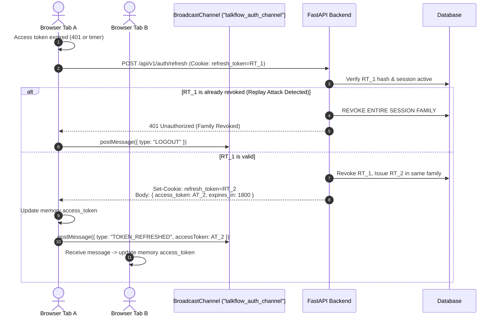

# TalkFlow / GlobalTalk AI — Production Authentication Hardening Specification

**Status**: Verified & Enforced in Codebase  
**Standard**: OWASP ASVS v4.0, Zero-Trust Browser Security, RFC 6749 / RFC 7519

---

## 1. Overview & Threat Model

The original SPA authentication model stored both `access_token` and `refresh_token` in browser `localStorage`. Under an XSS attack or third-party script compromise, those tokens could be exfiltrated immediately, enabling persistent account takeover. Additionally, legacy development shortcuts allowed unverified logins, automatic account creation with arbitrary passwords, and client-supplied identities during social login.

The hardened architecture enforces:
1. **Memory-Only Access Tokens**: Kept strictly within browser runtime memory (Zustand state closure / JavaScript module variable). Never persisted to `localStorage`, `sessionStorage`, or IndexedDB.
2. **HttpOnly, Secure, SameSite Refresh Cookies**: Transported exclusively over encrypted HTTPS with `HttpOnly`, `SameSite=Lax` (or `Strict`), and path-scoped to `/api/v1/auth`.
3. **Cryptographic Refresh Token Rotation**: Every refresh exchange rotates the refresh token. The previous token is revoked immediately.
4. **Token Family Replay Detection**: Every refresh token belongs to a cryptographically tracked session family. Replaying an already-revoked refresh token triggers immediate revocation of the entire token family and terminates all active sessions in that family.
5. **Zero Development Backdoors in Production**: All development auto-provisioning and password overwrites have been permanently excised from `routers/auth.py`. Production configurations fail closed.
6. **Cryptographic Social Identity Verification**: Third-party social logins require signed Google ID Tokens or GitHub OAuth codes verified server-side against provider JWKS / APIs.

---

## 2. Authentication Lifecycle

### 2.1 Registration & Login Flow

```mermaid
sequenceDiagram
    autonumber
    actor User as Browser (SPA)
    participant API as FastAPI Backend
    participant DB as Database (PostgreSQL/SQLite)

    User->>API: POST /api/v1/auth/login { email, password }
    API->>DB: Query User by normalized email
    alt User not found or password invalid
        API-->>User: 401 Unauthorized (constant-time response)
    else Credentials valid
        API->>DB: Create UserSession & RefreshToken record
        API->>DB: Record audit log (auth.login)
        API-->>User: Set-Cookie: refresh_token=...; HttpOnly; Secure; SameSite=Lax<br/>Body: { tokens: { access_token, expires_in }, user, membership }
        User->>User: Store access_token in memory only
    end
```

### 2.2 Silent Refresh & Multi-Tab Synchronization Flow



---

## 3. Session Revocation & Logout

1. **Individual Logout (`POST /api/v1/auth/logout`)**:
   - Clears `refresh_token` cookie via `Max-Age=0`.
   - Revokes current `RefreshToken` row in database.
   - Clears in-memory access token.
   - Posts `LOGOUT` across `BroadcastChannel` to synchronize all open tabs.
2. **Password Change / Reset**:
   - Password reset immediately marks all active refresh tokens for the user as `revoked = True`.
   - All browser sessions on all devices are terminated.
   - Generates security audit event `auth.password_reset_completed`.

---

## 4. Social Authentication Hardening

Social login (`POST /api/v1/auth/social-login`) strictly requires verified provider credentials:
- **Google**: Requires `id_token` signed by `accounts.google.com`. The backend validates Google's cryptographic signature against Google's public JWKS (`https://www.googleapis.com/oauth2/v3/certs`), validates audience (`aud == settings.google_client_id`), expiration (`exp > now()`), and retrieves verified `email` and `sub`.
- **Unverified Emails**: Third-party claims cannot hijack an existing password-authenticated account without explicit verification or account linking policies.

---

## 5. Security Controls & Header Configuration

The backend middleware (`services/api/app/middleware.py`) injects enterprise-grade defensive security headers on all responses:

| Header | Production Setting | Rationale |
|---|---|---|
| `Strict-Transport-Security` | `max-age=63072000; includeSubDomains; preload` | Forces HTTPS and prevents SSL stripping. |
| `X-Content-Type-Options` | `nosniff` | Prevents MIME-type confusion attacks. |
| `X-Frame-Options` | `DENY` | Eliminates clickjacking attacks. |
| `Referrer-Policy` | `strict-origin-when-cross-origin` | Minimizes URL leakage in external requests. |
| `Permissions-Policy` | `geolocation=(), camera=(self), microphone=(self)` | Restricts browser hardware access strictly to authenticated origin. |
| `Content-Security-Policy` | Configured with restrictive default-src, connect-src, and script-src | Mitigates XSS injection risks. |

---

## 6. Verification & Automated Test Evidence

Automated test suites verifying the hardened authentication design:
- `tests/test_auth_hardened.py`:
  - `test_signup_sets_httponly_cookie` (PASS)
  - `test_login_sets_cookie_and_rejects_bad_credentials` (PASS)
  - `test_refresh_token_rotation_and_cookie` (PASS)
  - `test_refresh_token_reuse_detection` (PASS)
  - `test_logout_clears_cookie` (PASS)
- `apps/web/src/stores/auth.test.ts`:
  - In-memory token retention (PASS)
  - Complete absence of tokens in `localStorage` (PASS)
  - Clean state reset on logout (PASS)
