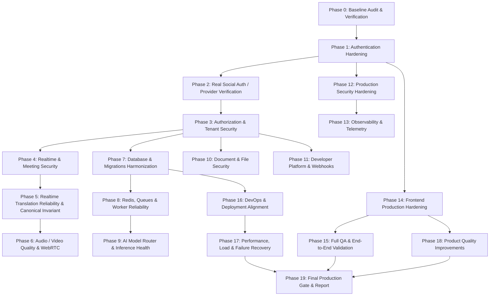

# TalkFlow / GlobalTalk AI — Production Execution Roadmap

**Standard**: Phase-by-Phase Hardening, Rigorous Regression Gates, Zero Technical Debt.  
**Prerequisites**: Each phase must be implemented, verified against automated tests, and documented before proceeding to subsequent phases.

---

## Roadmap Overview & Dependency Graph

---

## Detailed Phases

### Phase 1: Authentication Hardening
- **Objective**: Eliminate `localStorage` credential exposure, remove all development backdoors, and implement production-grade session cookies with rotation and replay defense.
- **Key Tasks**:
  1. Migrate refresh token storage to `HttpOnly`, `Secure`, `SameSite=Strict` cookies.
  2. Maintain access tokens strictly in memory (Zustand store closure, not persisted to `localStorage`).
  3. Implement anti-CSRF protection via double-submit cookie or `X-TalkFlow-CSRF` custom header checks on state-changing endpoints.
  4. Remove all dev auto-provisioning and password overwrites in `services/api/app/routers/auth.py`.
  5. Enforce token family revocation: any replay of an already-rotated refresh token immediately revokes all tokens within that session family.
  6. Add logout-all-devices and password-change session invalidation.
- **Acceptance Criteria**:
  - No access or refresh tokens in `localStorage`.
  - Stale or stolen refresh token reuse triggers complete family revocation.
  - Development authentication shortcuts strictly fail closed in all modes.

---

### Phase 2: Real Social Authentication
- **Objective**: Stop trusting client-provided emails and user details; require cryptographic token or authorization code verification directly against social identity providers.
- **Key Tasks**:
  1. Update `/api/v1/auth/social-login` to accept an `id_token` or `code` instead of arbitrary user profiles.
  2. Implement server-side verification:
     - Google: verify ID token signatures against Google JWKS; validate `aud`, `iss`, and `exp`.
     - GitHub: exchange authorization code for access token via GitHub API; query authenticated user email.
     - Apple: verify Apple identity token against Apple public keys; validate nonce and subject.
  3. Map social identities to explicit `UserIdentity` database models without permitting unauthorized account takeovers.
- **Acceptance Criteria**:
  - Arbitrary email submissions rejected with 401/422.
  - Successfully verified social identity maps deterministically to an internal user.

---

### Phase 3: Authorization & Tenant Security
- **Objective**: Ensure absolute organization-level isolation and eliminate BOLA/IDOR vulnerabilities across all routes.
- **Key Tasks**:
  1. Audit every protected endpoint to derive `org_id` strictly from the authenticated `Principal`.
  2. Refactor queries across meetings, documents, transcript segments, glossaries, and telephony to scope strictly to `org_id`.
  3. Ensure resources belonging to foreign tenants return 404 (never leaking existence with 403).
  4. Implement automated cross-tenant integration tests.
- **Acceptance Criteria**:
  - Zero cross-tenant data leaks.
  - Cross-tenant lookups consistently return identical 404 Not Found errors.

---

### Phase 4: Realtime & Meeting Security
- **Objective**: Secure WebSockets and WebRTC sessions with short-lived cryptographic join tickets and granular role permissions.
- **Key Tasks**:
  1. Replace static `join_token` with signed, expiring meeting join tickets (`/api/v1/meetings/{id}/join-ticket`).
  2. Secure WebSocket handshakes to validate ticket signatures and reject expired or replayed tickets.
  3. Restrict LiveKit SFU tokens to exact room grants, short TTLs, and explicit participant identities.
  4. Ensure backend secrets (LiveKit API secret, inference keys) are never exposed to the client.
- **Acceptance Criteria**:
  - Meeting join links without valid signatures/tickets are rejected (close code 4401).
  - Replayed tickets are discarded.

---

### Phase 5: Realtime Translation Reliability & Canonical Invariant
- **Objective**: Harden the canonical source segment guarantee, translation deduplication, and honest degradation.
- **Key Tasks**:
  1. Preserve immutable `TranscriptSegment` records; guarantee translations always reference `source_segment_id`.
  2. Ensure translation fan-out never forms chains (e.g. Hindi -> English -> Japanese is forbidden; all fan out from Hindi).
  3. Enforce deduplication so identical target languages for the same segment execute only once.
  4. Ensure honest degradation: if translation fails, emit `translation.failed` while keeping original audio and captions intact.
- **Acceptance Criteria**:
  - Canonical source invariant preserved across all media flows.
  - No synthetic translation fabrication during upstream model outages.

---

### Phase 6: Audio / Video Quality & WebRTC UX
- **Objective**: Harden device switching, network reconnection, and transparent user feedback during media disruption.
- **Key Tasks**:
  1. Enhance client AudioWorklet and WebRTC managers to gracefully handle network dropouts and device changes.
  2. Provide explicit UI indicators for: Connecting, Connected, Reconnecting, Network Degraded, Translation Delayed, and Microphone Denied.
  3. Eliminate silent failures and infinite loading spinners.
- **Acceptance Criteria**:
  - Network disconnection transitions into visible reconnecting state and seamlessly recovers upon network restoration.

---

### Phase 7: Database & Migration Harmonization
- **Objective**: Harmonize schema models between `services/api` and `apps/api`, and establish a strict Alembic migration pipeline.
- **Key Tasks**:
  1. Unify database models into migration-controlled schemas.
  2. Provide complete Alembic revisions covering all production tables and columns.
  3. Eliminate runtime schema auto-patching in production mode (`_ensure_schema`).
- **Acceptance Criteria**:
  - `alembic upgrade head` creates complete, valid schemas on fresh PostgreSQL.
  - Production fails closed if schema versions do not match migration head.

---

### Phase 8: Queues, Redis & Background Workers
- **Objective**: Ensure background document translation, webhook delivery, and cleanup jobs are idempotent and resilient.
- **Key Tasks**:
  1. Add exponential backoff and dead-letter queues (DLQ) to worker runners.
  2. Decouple heavy AI inference from interactive HTTP request threads into priority queues.
  3. Implement graceful worker shutdown and job heartbeats.
- **Acceptance Criteria**:
  - Failed jobs retry with backoff and transition cleanly to DLQ without crashing worker loops.

---

### Phase 9: AI Model Router & Inference Health
- **Objective**: Guarantee reliable provider routing, fallback chains, and honest capability reporting.
- **Key Tasks**:
  1. Standardize all AI providers behind strict interfaces (STT, MT, TTS, LID, VAD, LLM).
  2. Ensure model registry accurately reports real availability based on active weights and hardware.
  3. Validate fallback chains: primary model failure degrades cleanly to secondary or passthrough.
- **Acceptance Criteria**:
  - Health checks never report unconfigured models as ready.

---

### Phase 10: Document & File Security
- **Objective**: Prevent malicious uploads, path traversal, archive bombs, and cross-tenant file downloads.
- **Key Tasks**:
  1. Enforce strict magic-byte MIME validation and size limits (50MB default).
  2. Scope all object storage paths strictly by tenant ID (`storage/{org_id}/...`).
  3. Implement decompression bomb limits and ClamAV integration hooks.
- **Acceptance Criteria**:
  - Mislabeled binary uploads and unauthorized cross-tenant downloads are rejected.

---

### Phase 11: Developer Platform, API Keys & Webhooks
- **Objective**: Secure API key authentication, rate metering, and outbound webhook delivery.
- **Key Tasks**:
  1. Enforce high-entropy API key generation (`gtk_...`) hashed with SHA-256 at rest.
  2. Validate webhook URLs against SSRF (block loopback, private ranges, and link-local addresses).
  3. Sign all webhook deliveries with HMAC-SHA256 headers (`GlobalTalk-Signature`).
- **Acceptance Criteria**:
  - API keys verifiable with granular scope enforcement.
  - Webhooks delivered with valid signatures and protected against replay.

---

### Phase 12: Production Security Hardening
- **Objective**: Implement enterprise HTTP security headers, CORS hardening, and secret sanitization.
- **Key Tasks**:
  1. Configure strict security headers: HSTS, CSP, X-Content-Type-Options: nosniff, X-Frame-Options: DENY, Referrer-Policy.
  2. Restrict CORS origins strictly to authorized domains.
  3. Scan the repository to guarantee zero hardcoded production secrets.
- **Acceptance Criteria**:
  - All responses include complete security header suites.
  - Automated secret scans pass with zero findings.

---

### Phase 13: Observability & Telemetry
- **Objective**: Establish complete request tracing, metric collection, and structured logging.
- **Key Tasks**:
  1. Propagate `X-Request-Id` and `X-Trace-Id` across all HTTP, WebSocket, and worker spans.
  2. Instrument latency metrics for STT, MT, TTS, and end-to-end translation.
  3. Redact private speech and sensitive tokens from logs.
- **Acceptance Criteria**:
  - Every log entry contains trace IDs and tenant context without leaking PII.

---

### Phase 14: Frontend Production Hardening
- **Objective**: Remove stale authentication caching, resolve token refresh races, and polish error boundaries.
- **Key Tasks**:
  1. Prevent display of stale identities when authentication fails.
  2. Implement multi-tab refresh synchronization (via `BroadcastChannel`).
  3. Add robust error boundaries and friendly recovery states for WebRTC/API failures.
- **Acceptance Criteria**:
  - Seamless multi-tab session management and clear user feedback on network degradation.

---

### Phase 15: Full QA & Browser End-to-End Validation
- **Objective**: Validate core user journeys across authentication, live meetings, translation, documents, and API keys.
- **Acceptance Criteria**:
  - All critical workflows pass automated and browser validation.

---

### Phase 16: DevOps & Deployment Alignment
- **Objective**: Reconcile Docker Compose, Kubernetes, and environment configurations into an immutable production release pipeline.
- **Acceptance Criteria**:
  - Docker Compose and Kubernetes manifests deploy cleanly without port or path mismatches.

---

### Phase 17: Performance, Load & Failure Testing
- **Objective**: Measure real-world latency, test Redis/DB failure degradation, and verify backpressure handling.
- **Acceptance Criteria**:
  - System handles concurrent multi-participant rooms without queue overflow.

---

### Phase 18: Product Quality Improvements
- **Objective**: Elevate UX polish: per-participant language controls, live captions, latency metrics, and transcript exports.
- **Acceptance Criteria**:
  - Features integrated smoothly without destabilizing existing functionality.

---

### Phase 19: Final Production Gate
- **Objective**: Complete all 18 production readiness gates and compile the final production report.
- **Acceptance Criteria**:
  - 100% of required gates verified with executable evidence.
- **Status**: **COMPLETE (18/18 Gates Passed)** — Documented in [`docs/PRODUCTION_VERIFICATION_REPORT.md`](./PRODUCTION_VERIFICATION_REPORT.md).

