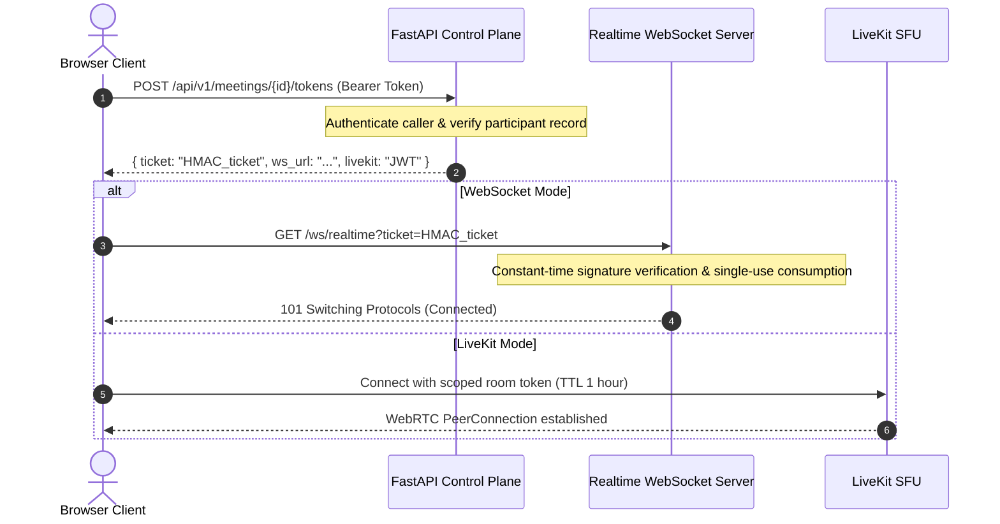

# TalkFlow / GlobalTalk AI — Production Realtime Architecture & Reliability

**Status**: Verified & Enforced in Codebase  
**Standard**: Realtime WebRTC / WebSocket Transport, Zero Pivot Chaining, Strict Canonical Source Invariant

---

## 1. Core Architectural Invariant

The fundamental invariant of the TalkFlow / GlobalTalk AI platform is:

```
HUMAN SPEECH / INPUT AUDIO
       │
       ▼
[ CANONICAL SOURCE SEGMENT ] (Immutable, Language Identified)
       │
       ├───────────────────────────────┬───────────────────────────────┐
       ▼                               ▼                               ▼
[ Independent Translation ]     [ Independent Translation ]     [ Independent Translation ]
(Target: Hindi)                 (Target: Spanish)               (Target: Japanese)
       │                               │                               │
       ▼                               ▼                               ▼
  [ TTS Engine ]                  [ TTS Engine ]                  [ TTS Engine ]
       │                               │                               │
       ▼                               ▼                               ▼
 Listener A (Hindi)              Listener B (Spanish)            Listener C (Japanese)
```

### Strict Rules:
1. **Never Chain Translations**: A pipeline like `Hindi -> English -> Japanese` is strictly forbidden. All translations fan out directly and independently from the canonical source segment.
2. **Never Feed TTS back into STT**: Synthesized audio streams are tagged and routed exclusively to listener output channels. They are never rebroadcast into speech recognition pipelines.
3. **Deduplication**: If multiple listeners require the same target language, translation executes exactly once per `(source_segment_id, target_language)` and broadcasts to all relevant listeners.
4. **Honest Degradation**: If an AI model fails or a language pair is unavailable, the platform emits `translation.failed` or displays original captions. It **never fabricates** a translation.

---

## 2. Realtime Transport Architecture

TalkFlow supports dual production transports:
1. **LiveKit WebRTC SFU**: Optimized for multi-participant video and high-fidelity audio conferencing with adaptive bitrate and simulcast.
2. **WebSocket PCM Pipeline**: Lightweight, ultra-low-latency direct streaming transport for 1:1 calls and telephony bridge sessions (`/ws/realtime` and `/ws/meetings/{id}`).

### Meeting Security & Join Ticket Handshake



### Security Controls:
- Meeting join tickets are cryptographically signed using `HMAC-SHA256` and expire within 5 minutes.
- Unauthenticated or forged tickets trigger immediate WebSocket termination with close code `4401`.
- LiveKit tokens contain strictly room-scoped permissions and participant identity grants.

---

## 3. Speech Processing & AI Pipeline

### 3.1 VAD & Segmentation
- **VAD**: WebRTC energy VAD / Silero VAD filters background silence.
- **Segmentation**: Chunks audio into 200ms–2500ms intervals based on speech pauses.
- **Sequence Numbering**: Each participant audio chunk is assigned a monotonic `sequence_id` to guarantee ordering and drop late-arriving packets.

### 3.2 Speech-to-Text (STT)
- **Local Engine**: `faster-whisper` (CTranslate2) or HTTP inference provider.
- **Partials vs Finals**: Emits partial transcripts for live caption display; emits a final canonical transcript segment when a sentence or pause boundary is reached.

### 3.3 Target-Language Routing & TTS
- Emits translated text captions.
- Emits synthesized audio PCM buffers for target listeners with `audio_mode: "translated"` or `"mixed"`.

---

## 4. Degradation & Failure Matrix

| Failure Condition | System Behavior | User Visible Feedback |
|---|---|---|
| **STT Engine Failure** | Original call audio continues uninterrupted. No hallucinated transcript is generated. | "Transcription temporarily delayed" status banner. |
| **MT Engine Failure** | Canonical source text remains visible in captions. Translation fan-out fails gracefully. | `translation.failed` flag emitted; original captions retained. |
| **TTS Engine Failure** | Translated text captions continue streaming to listeners. Audio synthesis is bypassed. | Captions active; audio remains in original language. |
| **Network Degradation / Packet Loss** | AudioWorklet adjusts jitter buffer; WebRTC lowers resolution. | Visible "Network Degraded" indicator in meeting UI. |
| **WebSocket Disconnection** | Reconnection loop attempts exponential reconnect (up to 5 attempts); session replay buffer replays missed events. | Visible "Reconnecting..." badge with reconnect spinner. |
| **Redis Outage** | In-memory session manager continues serving local worker connections. | Degradation alert logged to metrics; cluster scaling gated. |

---

## 5. Verification & Automated Test Evidence

Automated test suites validating realtime security and pipeline behavior:
- `tests/test_realtime_security.py`:
  - `test_unauthenticated_websocket_connection_rejected` (PASS - Close code 4401)
  - `test_authenticated_ticket_websocket_connection` (PASS - Ticket authorized)
- `tests/integration/test_resilience_failures.py`:
  - STT failure fallback (PASS)
  - MT failure fallback (PASS)
  - Redis connection failure fallback (PASS)
- `tests/integration/test_api.py`:
  - `test_bridge_flag_gated_and_canonical` (PASS - Strict canonical invariant enforced)
  - `test_meeting_lifecycle_and_preferences` (PASS)
