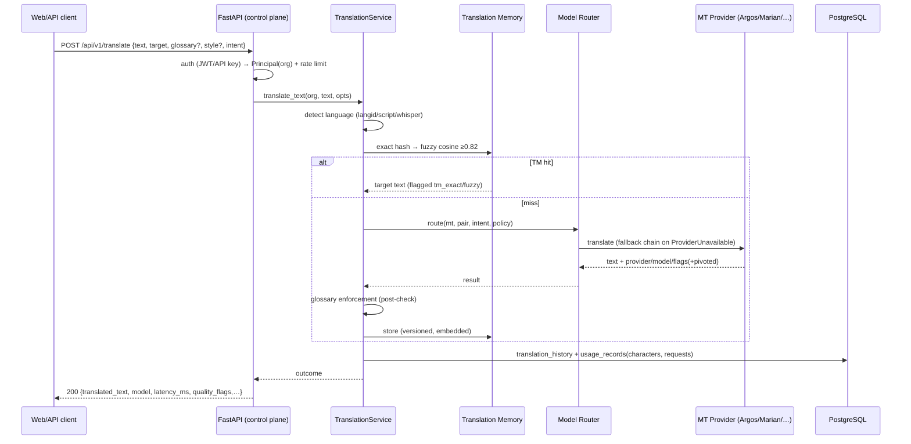
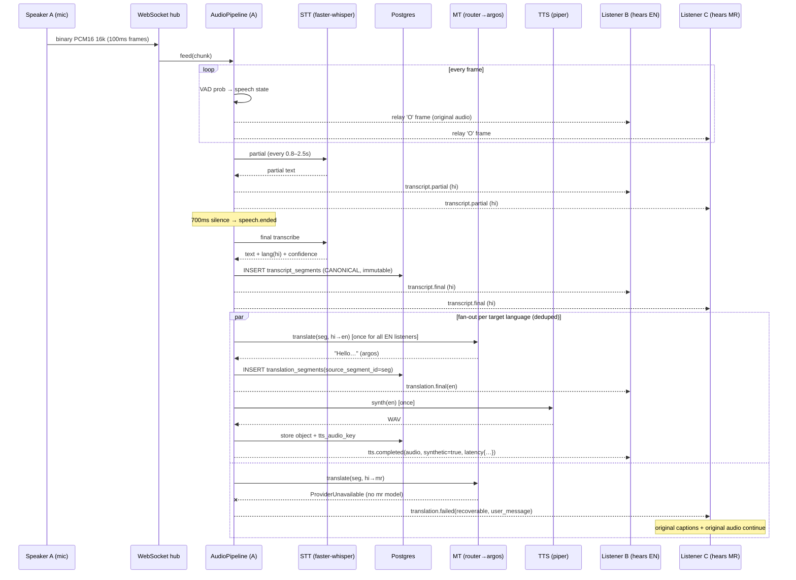
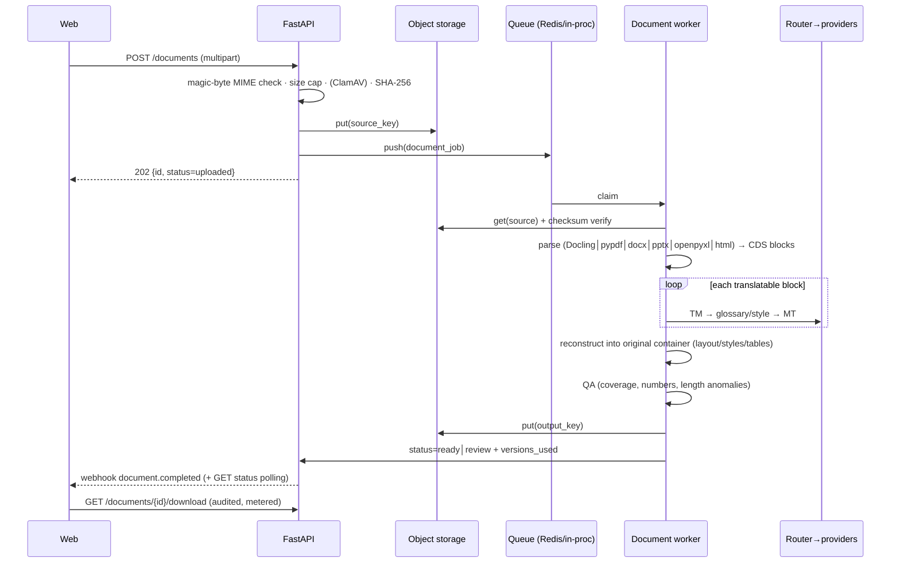

# Sequence Diagrams — core flows

## 1. Text translation (REST)



## 2. Realtime utterance (golden path)



## 3. Document translation



## 4. Reconnect & resume

```mermaid
sequenceDiagram
    participant B as Client B
    participant WS as Hub
    B--xWS: network drop
    Note over B: exponential backoff + jitter
    B->>WS: reconnect /ws/meetings/{id}?token=…
    B->>WS: session.join {resume:true, last_sequence:1040}
    WS->>WS: load persisted preferences (DB)
    WS-->>B: session.resumed (seq 1051)
    WS-->>B: replay events 1041…1050 (ring buffer)
    Note over B: dedupe by sequence; reconcile via REST transcript if gap > buffer
    WS-->>B: live events continue (1052…)
```
