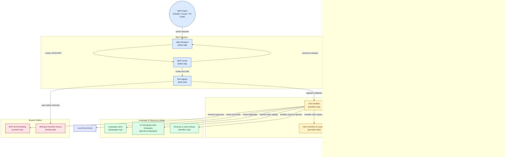

# Desi MCP Server

[](LICENSE)

A Model Context Protocol (MCP) server that exposes **Desi Language AI** and **GlobalTalk AI** text translation, Indic-native honorific transformation, cross-script phonetic transliteration, Unicode normalization, document translation, rephrasing, and enterprise glossary/style lookups as MCP tools.

---

## Architecture Overview



---

## Quick Start

You need **Node.js 18 or newer**.

### Directly with Node:

```bash
DESI_API_KEY=your-api-key node src/index.mjs
```

Or point to a custom GlobalTalk AI Gateway instance:

```bash
DESI_API_URL=http://127.0.0.1:8088 DESI_API_KEY=gtk_demo_key:fx node src/index.mjs
```

---

## MCP Client Configuration

### Claude Code

```bash
claude mcp add desi --env DESI_API_KEY=your-api-key --env DESI_API_URL=http://127.0.0.1:8088 -- node <path-to-desi-mcp-server>/src/index.mjs
```

### Claude Desktop / Cursor / VS Code (`claude_desktop_config.json` or `mcpServers` settings)

```json
{
  "mcpServers": {
    "desi": {
      "command": "node",
      "args": ["<path-to-desi-mcp-server>/src/index.mjs"],
      "env": {
        "DESI_API_KEY": "gtk_demo_key:fx",
        "DESI_API_URL": "http://127.0.0.1:8088"
      }
    }
  }
}
```

---

## Available Tools

### 1. Desi Indic-Native Tools

| Tool | Description | Parameters |
| :--- | :--- | :--- |
| `translate-desi` | Translates text into Indic languages with cultural honorifics (*Aap*, *Tum*, *Tu*, *-ji*) and domain registers. | `text`, `targetLang`, `sourceLang?`, `honorific?`, `domain?`, `respectfulSuffix?` |
| `transliterate-desi` | Phonetically converts text between Latin/Hinglish and Indic scripts (Devanagari, Gurmukhi, Tamil, etc.). | `text`, `sourceScript?`, `targetScript?` |
| `normalize-desi` | Cleans Indic Unicode anomalies, fixing Nuktas and removing stray ZWNJ / ZWJ codepoints. | `text`, `cleanZwnj?`, `fixNuktas?` |
| `get-desi-languages` | Returns the complete catalog of all 22 official Eighth Schedule Indian languages. | *none* |

### 2. Global Translation & Style Tools

| Tool | Description | Parameters |
| :--- | :--- | :--- |
| `translate-text` | Translates text into 100+ global world languages using the GlobalTalk AI engine. | `text`, `targetLangCode`, `sourceLangCode?`, `formality?`, `glossaryId?`, `styleId?`, `context?`, `preserveFormatting?`, `splitSentences?`, `customInstructions?` |
| `translate-document` | Translates a document file (PDF, DOCX, PPTX, XLSX, HTML, TXT) and writes the result to disk. | `inputFile`, `targetLangCode`, `outputFile?`, `sourceLangCode?`, `formality?`, `glossaryId?`, `styleId?`, `outputFormat?` |
| `rephrase-text` | Rephrases text for style, tone, or fluency, optionally into another target language. | `text`, `targetLangCode?`, `style?`, `tone?` |
| `correct-text` | Corrections-only mode for fixing spelling and grammar without changing style. | `text`, `targetLangCode?` |
| `get-source-languages` | Lists all supported source language codes. | *none* |
| `get-target-languages` | Lists all supported target language codes. | *none* |
| `get-writing-styles` | Lists supported writing styles (`academic`, `business`, `casual`, `simple`, `default`). | *none* |
| `get-writing-tones` | Lists supported tones (`confident`, `diplomatic`, `enthusiastic`, `friendly`, `passive`). | *none* |

### 3. Enterprise Resource Lookups

| Tool | Description | Parameters |
| :--- | :--- | :--- |
| `list-glossaries` | Lists all multilingual and bilingual glossaries in the account. | *none* |
| `get-glossary-info` | Returns metadata for a single glossary by ID. | `glossaryId` |
| `get-glossary-dictionary-entries` | Returns term pairs for a specific language pair within a glossary. | `glossaryId`, `sourceLangCode`, `targetLangCode` |
| `list-style-rules` | Lists enterprise style rules with IDs and timestamps. | `page?`, `pageSize?`, `detailed?` |
| `get-style-rule` | Returns full details of a style rule including configured rules and custom instructions. | `styleId` |
| `get-custom-instruction` | Returns a single custom instruction belonging to a style rule. | `styleId`, `instructionId` |

---

## License

Licensed under the [MIT License](LICENSE).
Copyright (c) 2026 GlobalTalk AI Authors. All rights reserved.
