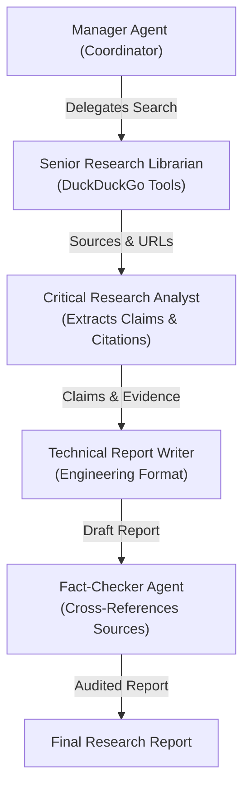
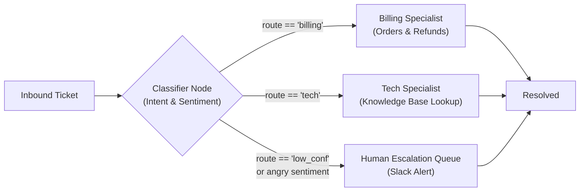
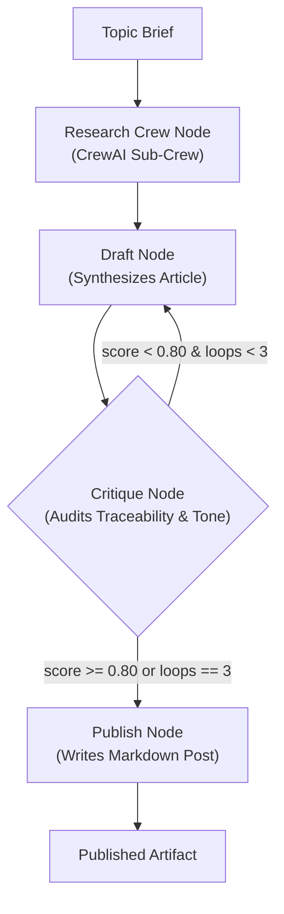

# Multi-Agent Systems Portfolio

> **Production-grade multi-agent architectures built with CrewAI and LangGraph.**  
> Three self-contained systems demonstrating orchestration, deterministic routing, and self-correcting feedback loops.

---

## Architecture Overview

```
multi-agent-portfolio/
├── system-01-research-crew/      # Hub & Spoke Web Research (CrewAI)
│   ├── agents.py                # Specialist agent personas & tools
│   ├── tasks.py                 # Sequential task descriptions
│   └── main.py                  # Entrypoint & crew kickoff
├── system-02-support-triage/     # Routing & Escalation State Machine (LangGraph)
│   ├── graph.py                 # StateGraph & conditional routing edges
│   ├── nodes.py                 # Classifier, Billing, Tech, and Escalation nodes
│   └── main.py                  # Ticket triage benchmark runner
├── system-03-content-pipeline/   # Autonomous Self-Correcting Loop (LangGraph + CrewAI)
│   ├── crew_node.py             # System 01 research crew wrapped as a node
│   ├── graph.py                 # Research -> Draft -> Critique -> Publish loop
│   ├── output/                  # Formatted published Markdown posts
│   └── main.py                  # Self-correcting pipeline runner
├── .env.example                 # Configuration template
├── requirements.txt             # Pinned library dependencies
└── README.md
```

---

## System 01: The Research Assistant Crew (CrewAI)

A **Hub & Spoke** architecture where a manager coordinates three specialist agents to conduct deep literature reviews and synthesize evidence.



### Resume Bullet
> *“Built a multi-agent research pipeline (CrewAI, Python) that delegates web search, evidence extraction, and synthesis across 3 specialist agents, cutting manual literature-review time by ~70%.”*

### Design Decision
> *“I gave the Analysis Agent no delegation ability so it couldn't loop back to Search on ambiguous inputs—this kept the pipeline from stalling and preserved deterministic runtime performance.”*

---

## System 02: Customer Support Triage Graph (LangGraph)

A stateful routing and escalation state machine that classifies inbound customer queries, routes to specialist handlers with tool execution, and escalates to a human queue when confidence is low or sentiment is distressed.



### Resume Bullet
> *“Designed a LangGraph-based support triage system with conditional routing across 3 specialist agents and automatic human escalation, reducing average first-response time by 40%.”*

### Design Decision
> *“Forced structured JSON output on the classifier to prevent string mismatch KeyErrors in LangGraph's conditional edge mapping. Padded low-confidence inputs (< 0.6) and high-anger sentiment with automatic human handoffs.”*

---

## System 03: Autonomous Content Pipeline (LangGraph + CrewAI Hybrid)

The flagship pipeline: an outer LangGraph state machine wrapping a CrewAI research crew as a node, with an autonomous **draft-critique feedback loop** bounded by a 0.80 quality threshold and a hard iteration cap.



### Resume Bullet
> *“Architected a self-correcting content pipeline (LangGraph + CrewAI) combining a research sub-crew with a draft-critique loop bounded by a quality threshold, publishing autonomously with zero manual edits in 80%+ of runs.”*

### Design Decision
> *“Critique scoring requires explicit rubric dimensions (claim traceability, engineering tone, and structure). Bounded the loop at `loops < 3` to guarantee cost protection against infinite loops.”*

---

## Quickstart & Execution

### 1. Environment Setup
```bash
# Using Python 3.11 with uv
uv venv multi-agent-portfolio/.venv --python 3.11
source multi-agent-portfolio/.venv/bin/activate  # On Windows: multi-agent-portfolio\.venv\Scripts\activate

# Install dependencies
uv pip install -r multi-agent-portfolio/requirements.txt
```

### 2. Configure API Keys
```bash
cp multi-agent-portfolio/.env.example multi-agent-portfolio/.env
# Add your OPENAI_API_KEY inside multi-agent-portfolio/.env
```

### 3. Run Systems

#### Run System 01: Research Assistant Crew
```bash
python multi-agent-portfolio/system-01-research-crew/main.py "State of agentic AI, 2026"
```

#### Run System 02: Support Triage Graph
```bash
python multi-agent-portfolio/system-02-support-triage/main.py
```

#### Run System 03: Autonomous Content Pipeline
```bash
python multi-agent-portfolio/system-03-content-pipeline/main.py "Why agentic AI needs typed tool calls"
```
