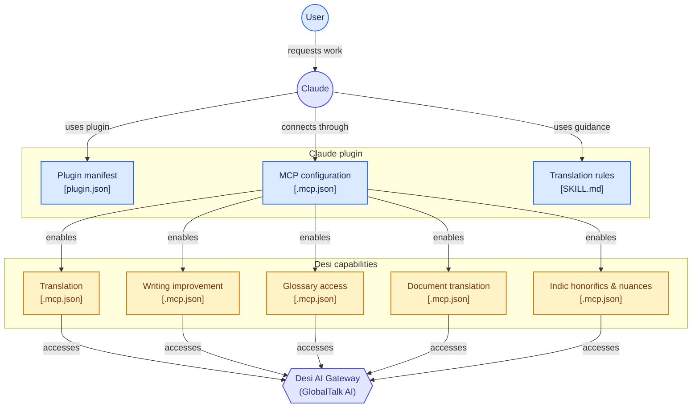

# Desi Claude Plugin (`desi-claude-plugin`)

[](LICENSE)
[](https://anthropic.com/claude)
[](https://modelcontextprotocol.io)

Official **Claude Plugin** that exposes **Desi Language AI** and **GlobalTalk AI** capabilities directly inside Anthropic Claude Desktop and Claude Code: high-precision neural translation across **100+ global languages** and all **22 official Eighth Schedule Indian languages**, 3-tier cultural formality honorifics (*Aap / Tum / Tu*), AI writing enhancement, multilingual glossaries, and layout-preserving document translation.

---

## 🏛️ Architecture Overview

The initiating actor is the user chatting with Claude. Claude inspects the plugin manifest and translation guidance rules (`SKILL.md`), connects through the Model Context Protocol configuration (`.mcp.json`), and accesses the Desi AI Gateway:



---

## 🌟 Capabilities

| Capability | Description | MCP Tools Exposed |
|---|---|---|
| 🌍 **Global Text Translation** | Neural translation across 100+ international languages with formality control (*more*, *less*). | `translate-text`, `get-target-languages`, `get-source-languages` |
| 🇮🇳 **22 Indic Languages & Honorifics** | Cultural formality registers (*Aap / Tum / Tu*), respectful suffixes (*-जी*, *-గారు*, *-அவர்கள்*), and domain styles (*official*, *business*, *colloquial*). | `translate-desi`, `get-desi-languages` |
| ✍️ **Writing Enhancement (Desi Write)** | Tone transformation (*confident*, *diplomatic*, *friendly*), style rephrasing (*business*, *academic*, *casual*, *simple*), and grammar corrections. | `rephrase-text`, `correct-text`, `get-writing-styles`, `get-writing-tones` |
| 📄 **Document Translation** | Layout-preserving asynchronous translation for DOCX, PDF, PPTX, XLSX, HTML, and TXT files. | `translate-document` |
| 📚 **Glossary & Style Rules** | Enterprise dictionary lookup and terminology consistency enforcement. | `list-glossaries`, `get-glossary-info`, `list-style-rules`, `get-style-rule` |
| 🔤 **Transliteration & Normalization** | Converts Romanized Hinglish/Tanglish into native Brahmic scripts and cleans Indic Unicode ZWNJ/Nuktas. | `transliterate-desi`, `normalize-desi` |

---

## 🚀 Setup & Authentication

### 1. First-Time Sign-In & Authentication
Access to Desi services is authorized via the `DESI_API_KEY` environment variable. When Claude first needs to invoke translation or writing enhancement tools, it verifies credentials:

```bash
# Provide your Desi API key
export DESI_API_KEY="gtk_live_your_api_key_here"

# Optional: Point to custom or local GlobalTalk AI instance
export DESI_API_URL="http://127.0.0.1:8088"
```

*(Backwards compatibility: If `GLOBAL_TALK_API_KEY` or `DEEPL_API_KEY` is present in the environment, it is automatically accepted as a fallback).*

### 2. Adding to Claude Code
To register this plugin in Claude Code:

```bash
claude plugin add ./plugins/desi-claude-plugin
```

### 3. Adding to Claude Desktop
Add the following block to your `claude_desktop_config.json`:

```json
{
  "mcpServers": {
    "desi": {
      "command": "node",
      "args": ["<path-to-globaltalk-ai>/mcp/desi-mcp-server/src/index.mjs"],
      "env": {
        "DESI_API_KEY": "gtk_live_your_api_key_here",
        "DESI_API_URL": "http://127.0.0.1:8088"
      }
    }
  }
}
```

---

## 💡 Example User Invocations with Claude

Once installed, Claude automatically applies Desi capabilities when you ask:

- **Indic Honorifics**:
  > *"Claude, translate our welcome email into Hindi using formal honorifics (Aap) and address the user with the respectful suffix -ji."*
- **Tone & Style Adaptation**:
  > *"Claude, rephrase this incident post-mortem into a business-diplomatic tone using Desi Write."*
- **Document Translation**:
  > *"Claude, translate `quarterly_report.docx` to German while keeping tables and formatting intact."*
- **Phonetic Transliteration**:
  > *"Claude, convert 'Aapka bohot bohot dhanyavaad' into Devanagari script."*
- **Enterprise Terminology**:
  > *"Claude, check our customer glossary and translate this API release note to Japanese."*

---

## 📄 License

Licensed under the **MIT License** — see the [LICENSE](LICENSE) file for details.  
Copyright (c) 2026 GlobalTalk AI Authors and Contributors.
